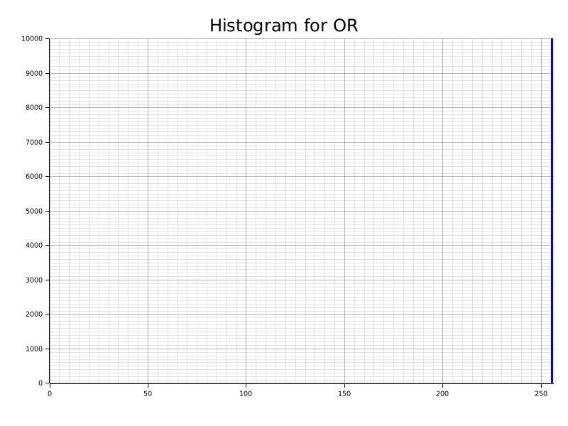
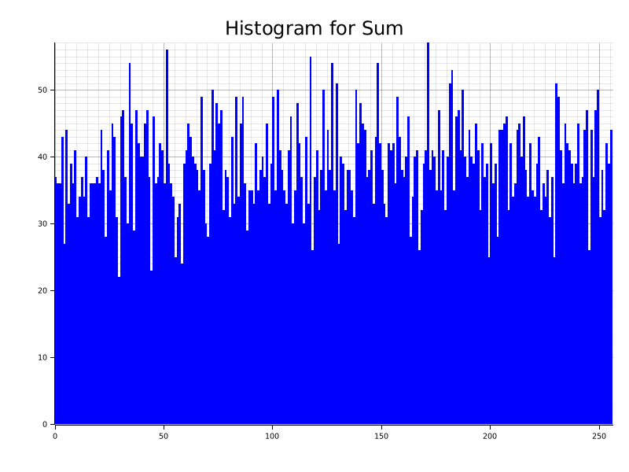
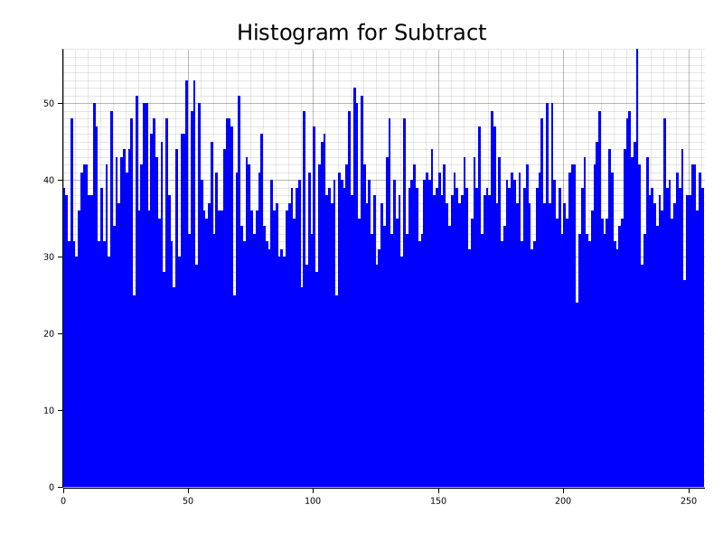
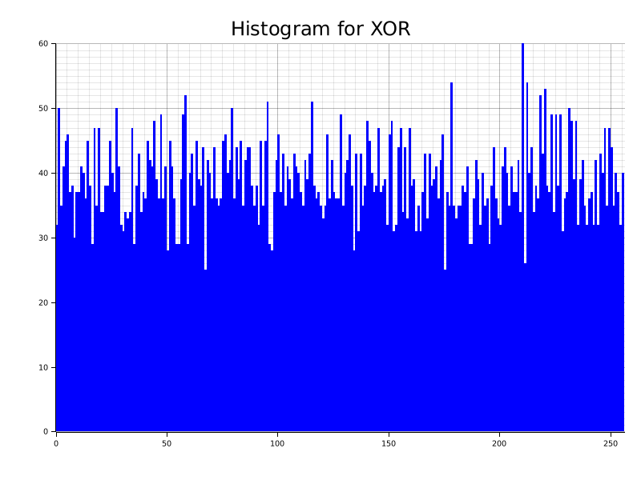
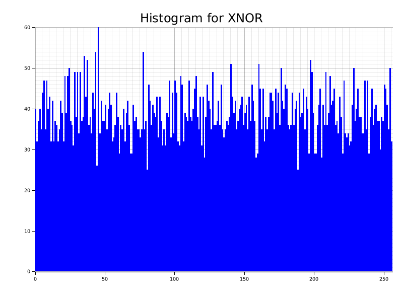
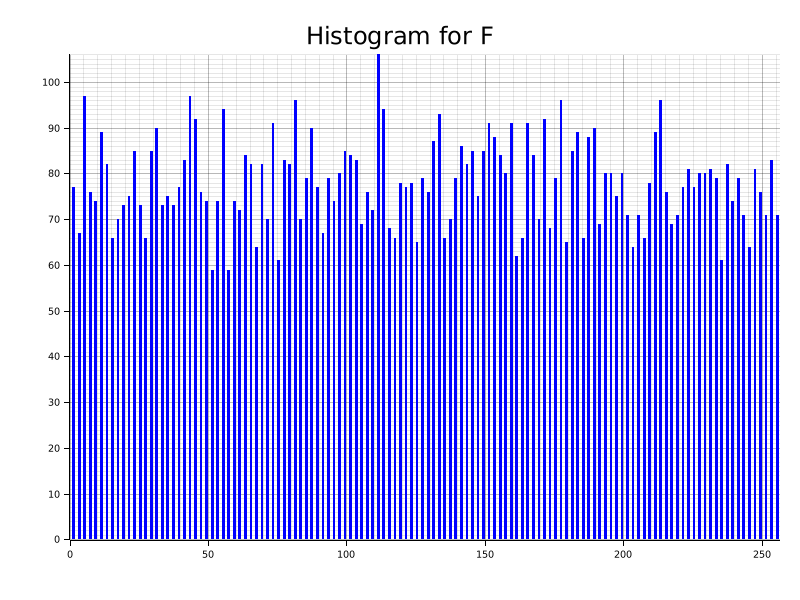
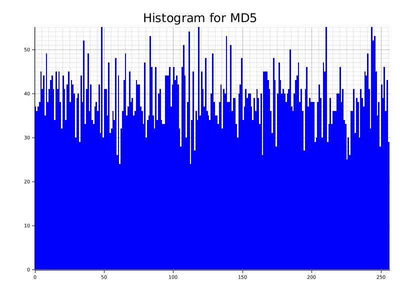
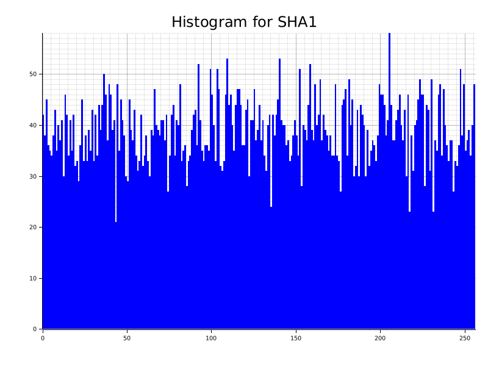
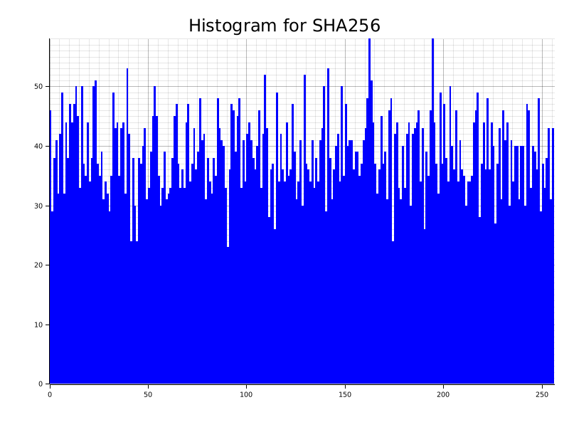
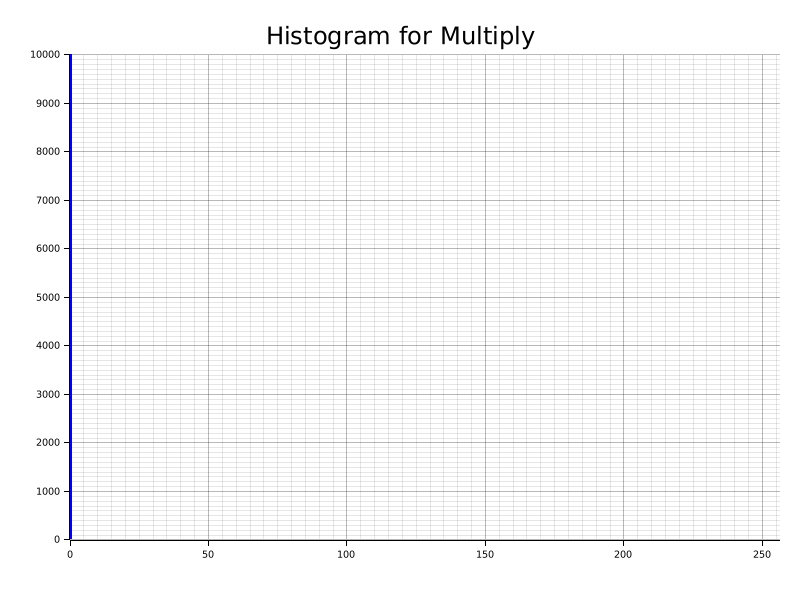

## ⭐ Introduction

This project performs a detailed distribution analysis of several checksum algorithms and modern cryptographic hash functions.
To evaluate their behavior, the system processes 10,000 structured data blocks, each block containing 128 bytes arranged in a 16 × 8 matrix. These blocks are extracted sequentially from a real file (sample.png), ensuring that the dataset reflects meaningful, non-random binary patterns typically found in real-world digital content.

## 📦Dataset Overview

- 10,000 total blocks  
- 128 bytes per block (16×8 layout)  
- Extracted directly from a real image file
  
## 🎯 Project Objective

The goal of this analysis is to examine and compare:

 - Low-level checksum algorithms
(SUM, SUBTRACT, MULTIPLY, AND, OR, XOR, XNOR, and a custom function F)

 - Cryptographic hash functions
(SHA-1, MD5, SHA-256)

 with respect to the following characteristics:

- Output value distribution (0–255 range)

- Bias and clustering tendencies

- Entropy strength

- Diffusion capability

- Sensitivity to structured input

This creates a clear contrast between simple arithmetic-based checksums and nonlinear, high-entropy cryptographic algorithms.

## 📊 Generated Output

For each algorithm, the system produces a histogram visualization showing how frequently each of the 256 possible byte values appears across all processed blocks.

These histograms allow us to:

- Identify uniform vs. biased distributions

- Observe entropy differences

- Compare checksum behavior to cryptographic diffusion

- Highlight the impact of structured data on algorithm output

The result is a comprehensive statistical view of how each algorithm transforms meaningful input data into reduced 8-bit outputs

## 🚀 Getting Started

Follow the steps below to clone, build, and run the project.

📥 1. Clone the Repository

Use `git clone` to pull the project from GitHub:
```bash
git clone https://github.com/salirezaeb/checksum.git
cd DSD_AUT_checksum
```
🛠️ 2. Build the Project

Make sure you have Rust & Cargo installed:
👉 https://www.rust-lang.org/tools/install

🛠️ Build in debug mode:
```bash
cargo build --release
```
▶️ 3. Run the Program
```bashe
cargo run
```
## 📊 4. Output Files

After execution, histogram plots will be generated in the project directory:

- Sum.png

- Subtract.png

- Multiply.png

- AND.png

- OR.png

- XOR.png

- XNOR.png

- F.png

- SHA1.png

- MD5.png

- SHA256.png
  
## 📊 Output Distribution Analysis

This section provides a technical interpretation of the distribution behavior observed in all generated histograms. Each plot represents the frequency of 8-bit output values (0–255) computed across 10,000 structured 128-byte blocks extracted from the input image file (`sample.png`). Using a real image as the data source ensures that the analyzed blocks contain meaningful, non-random byte patterns derived from actual file structure rather than synthetic noise. Differences in histogram shape directly reflect the internal structure, entropy characteristics, and diffusion properties of each algorithm.


🟦 1. AND

The AND operation collapses extremely quickly toward zero because any bit cleared in any input byte permanently clears that bit in the final result. Since natural data (such as bytes from an image file) almost always includes zeroes in various bit positions, the accumulated AND value almost always becomes `0x00` after only a few bytes. As a result, the histogram forms a single tall spike at value 0, showing that the algorithm has essentially no entropy or distribution capability and is completely unsuitable for checksum or randomness analysis.


🟦 2. OR

The OR operation behaves in the opposite direction of AND but suffers from the same structural weakness. Any bit set in any input byte forces the corresponding bit in the final output to become 1, and once a bit becomes 1, it cannot revert. Because real-world data almost always contains many set bits, the OR result quickly converges to 0xFF. Therefore, the histogram shows an overwhelming spike at 255, indicating total collapse and lack of distribution diversity.



🟦 3. Sum

The SUM algorithm adds all bytes and reduces modulo 256. This produces a result that depends on the overall intensity of the block but wraps around frequently due to overflow. As a result, the histogram shows moderate spread across many output values, but it is still far from uniform. Clustering appears in mid-range values, and the behavior remains predictable because the operation is linear and sensitive to the average byte value rather than their structure.



🟦 4. Subtract

The SUBTRACT method accumulates positive or negative drift depending on byte order, and like SUM, it wraps modulo 256. The distribution ends up noisy but still noticeably clustered and non-uniform. The histogram displays a scattered pattern similar to SUM but with stronger fluctuations because subtraction is order-dependent and more sensitive to local variations in the data. Despite looking noisy, it still lacks true randomness and has low diffusion strength.



🟦 5. XOR

The XOR checksum combines all bytes using bitwise exclusive-or. XOR is more balanced and removes some additive bias seen in SUM and SUBTRACT, producing a wider histogram that covers most of the 0–255 range. However, because XOR is a fully linear operator, its output still displays spikes and irregularities rather than a flat distribution. It mixes bits better than arithmetic operations but still lacks nonlinear diffusion, meaning the output remains somewhat predictable.



🟦 6. XNOR

XNOR is simply the bitwise NOT of the XOR result, so its distribution is almost identical to XOR but mirrored around 255. Like XOR, it covers most output values but still shows noticeable peaks and valleys due to linearity. XNOR does not improve entropy; it merely transforms the structure of XOR’s output.



🟦 7. Custom F Function

The custom function F combines SUM, XOR, AND, and OR to introduce nonlinear interactions. Because SUM and XOR contribute broader value ranges, while AND and OR contribute extreme values, the combined result exhibits improved dispersion. The histogram for F looks more uniform than any classical checksum above, showing less bias while still not achieving cryptographic quality randomness. It represents a midpoint between simple checksums and true hash functions.



🟦 8. MD5

MD5 applies multiple rounds of nonlinear transformation, modular addition, and bit rotations. Even when only the first byte of its 128-bit output is used, the resulting histogram is nearly uniform. The distribution shows small natural fluctuations typical of high-entropy random-like outputs. This demonstrates strong avalanche behavior, meaning tiny input changes propagate unpredictably throughout the output.



🟦 9. SHA-1

SHA-1 uses a more complex compression function than MD5 and repeats mixing operations many times, resulting in strong diffusion. The histogram of the first byte is extremely uniform, with no observable clustering or collapse. The output demonstrates excellent randomness properties, consistent with the expected behavior of a cryptographic hash function, even when applied to structured data rather than random input.



🟦 10. SHA-256

SHA-256 provides the strongest and most uniform distribution among all tested methods. Its internal structure includes nonlinear Boolean functions, modular additions, and numerous rounds of transformation, producing high-entropy output. The histogram of the first byte is almost perfectly flat, with only small statistical deviations. This reflects SHA-256’s role as a modern cryptographically secure hash designed to behave indistinguishably from random output



🟦Multiply

The multiplication-based checksum multiplies values and reduces modulo 256. However, because many byte values are even, each multiplication introduces factors of two, which quickly force the result to drop to zero modulo 256. After enough multiplications, the output almost always becomes 0, making the histogram nearly identical to AND or OR but collapsed at zero. This behavior shows that modular multiplication in such a small numeric space is unstable and not suitable for uniform distribution analysis.



## 🧪 Error Detection Coverage (Adjacent 2-Bit Flips)
In the error-detection coverage stage, the ability of each 8-bit checksum to detect adjacent 2-bit errors has been evaluated on extracted 128-byte blocks. For each block, the original checksum value was computed first. Then, for every adjacent bit pair (p, p+1) within the 1024-bit block (p from 0 to 1022), the two bits were flipped to form a corrupted block, and the checksum was recomputed. An error case was counted as detected when the recomputed value differed from the original value; otherwise, it was counted as undetected. Coverage was reported as the percentage of detected cases over all tested cases across all blocks. Results are shown below:
| Algorithm | Adjacent 2-Bit Detection Coverage (%) |
|----------|----------------------------------------|
| Sum      | 100.000000 |
| Subtract | 100.000000 |
| Multiply | 0.000000 |
| AND      | 0.000000 |
| OR       | 0.000000 |
| XOR      | 100.000000 |
| XNOR     | 100.000000 |
| F        | 68.760538 |


## 🧠 Conclusion

This project demonstrates how different checksum mechanisms and cryptographic hash functions behave when applied to structured, meaningful binary data rather than synthetic randomness. The results highlight a clear distinction between simple arithmetic/bitwise reductions and true cryptographic algorithms. Basic operations such as AND, OR, and MULTIPLY collapse rapidly to single dominant values, revealing extremely low entropy and no practical distribution strength. SUM, SUBTRACT, XOR, and XNOR provide wider distributions but remain fundamentally linear and predictable, showing visible clustering patterns that reflect the structure of the input data. The custom function F improves dispersion by mixing multiple operations, but still cannot achieve cryptographic-level randomness.

In contrast, MD5, SHA-1, and SHA-256 exhibit strong diffusion and near-uniform output distributions, even when only a single byte of their digest is examined. Their histograms resemble random noise, demonstrating robust avalanche behavior and resistance to bias. These results confirm that cryptographic hash functions are uniquely capable of producing high-entropy, unbiased transformations of structured input blocks, while classical checksums remain unsuitable for any application requiring unpredictability, uniformity, or collision resistance. Overall, the project provides a clear visual and statistical comparison of algorithmic behavior, illustrating the fundamental gap between lightweight checksums and modern cryptographic primitives.

### Connect with me via Linkedin for more information
